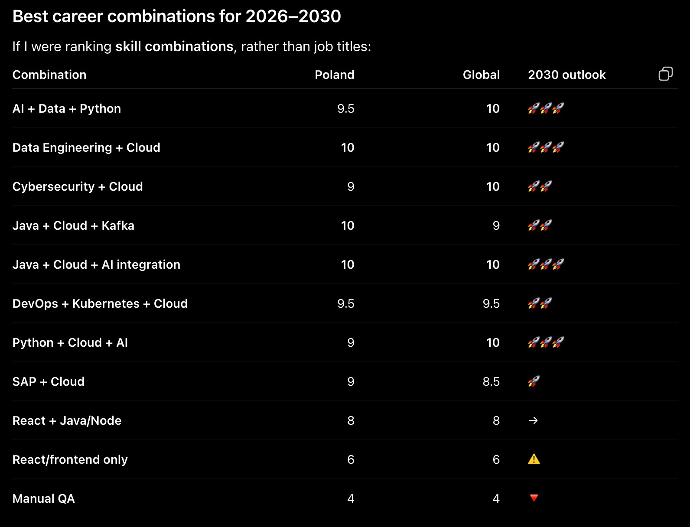

# Java Practice

A personal sandbox repo for practicing Java: working through exercises, algorithms, data structures, and small standalone programs.

## Purpose

- Practice core Java syntax and OOP concepts
- Work through algorithm and data structure problems

### Repo will be updated across learning process

## Structure

```
software-engineering-path/
└── lab#n/       # Java source files / exercises
```

## Plan



## Resources & Links

**Official docs**
- [Java SE](https://jenkov.com/tutorials/java/syntax.html)
- [Computer Science Roadmap](https://roadmap.sh/computer-science/)

**Practice platforms**
- [LeetCode](https://leetcode.com/)

**Learning references**
- [Java Design Patterns](https://refactoring.guru/refactoring/)


**Homework**
- 20.08.26:
  - read module1 folder ppts
  - read titles from https://jenkov.com/tutorials/java/syntax.html:
    Your First Java App
    Java Main Method
    Java Project Overview, Compilation and Execution
    Java Core Concepts
    Java Syntax
    Java Variables
    Java Data Types
    Java Math Operators and Math Class
    Java Arrays
    Java String
    Java Operations
    Java if statements
    Java Ternary Operator
    Java switch Statements
    Java instanceof operator
    Java for Loops
    Java while Loops
  - watch https://www.youtube.com/watch?v=ut74oHojxqo
  - play git game part "Introduction Sequence": https://learngitbranching.js.org/ 
- 03.09.26:
  - read 02_wrappers.pptx and 02_OOP_classes.pptx in module 2 folder